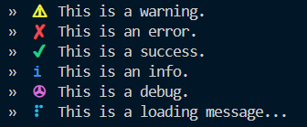

# Lowcon


**Lowcon** (also known as *lowkey-console*) is a minimalist, highly customizable logging utility for Node.js that enhances your console output with styled, colorful messages. It features animated loading indicators, progress bars, customizable log prefixes, and supports various logging levels. All while leveraging external libraries like `ora` and `cli-progress`.

## Support
- Project on [GitHub](https://github.com/OptiFiire/lowcon).
- By following the creator [OptiFire](https://github.com/OptiFiire/).

## Features

- 🎨 **Customizable Colors**: Define and personalize log colors using ANSI escape codes for better visual clarity.
- ⚠️ **Built-in Log Types**: Convenient methods for warnings, errors, debug, success, and info logs.
- ⏳ **Animated Loading Symbols**: Add dynamic loading indicators with a range of symbols.
- 📊 **Progress Bars**: Create interactive progress bars to track tasks or download progress.
- 🖋 **Customizable Prefixes**: Effortlessly add and tweak prefix characters for each log type.
- 🎯 **External Dependency Support**: Integrated with `ora` for loading indicators and `cli-progress` for progress bars.

## Preview

Here’s a preview of **Lowcon** in action:



## Installation

Install **Lowcon** via npm:

```bash
npm install lowkey-console
```

## Usage

Here’s an example of how to use **Lowcon** in your Node.js project:

```js
import lowcon from 'lowkey-console'

// Simulate warn, error, success, info and debug state.

lowcon.warn('This is a warning.', { useBrackets: false, keepColoring: false, prefixChar: '»  ' });
lowcon.error('This is an error.', { useBrackets: false, keepColoring: false, prefixChar: '»  ' });
lowcon.success('This is a success.', { useBrackets: false, keepColoring: false, prefixChar: '»  ' });
lowcon.info('This is an info.', { useBrackets: false, keepColoring: false, prefixChar: '»  ' });
lowcon.debug('This is a debug.', { useBrackets: false, keepColoring: false, prefixChar: '»  ' });
```

### Log Methods

- **warn(message, options)**: Logs a warning message.
- **error(message, options)**: Logs an error message.
- **success(message, options)**: Logs a success message.
- **info(message, options)**: Logs an informational message.
- **debug(message, options)**: Logs a debug message.

### Animated Loading

Create dynamic loading indicators:

```js
// Simulate a loading state.

const loadingSession = lowcon.loading('This is a loading message...',
    {
        useBrackets: false,
        keepColoring: false,
        prefixChar: '» ',
        onSuccess: (data) => `This is a successfully loaded message with status : ${data.code}`,
    })

setTimeout(() => loadingSession.success({ code: 204 }), 5000);
```

### Progress Bar

Track the progress of an ongoing task:

```js
let progressValue = 0;

const progressSession = lowcon.progress('Downloading...', progressValue, {
    useBrackets: false,
    keepColoring: false,
    barWidth: 10,
    prefixChar: '»  ',
    onSuccess: (data) => `This is a successful progress message with status : ${data.code}`,
    onFail: (data) => `This is an failed progress message with status : ${data.code}`
});

const timer = setInterval(function () {
    progressValue++
    progressSession.update(progressValue)

    if (progressValue >= 100) {
        clearInterval(timer);
        progressSession.succeed({ code: 200 });
    }
}, 100);
```

### Customization

You can easily modify log colors, symbols, and other settings with `setConfig()`:

```js
import { setConfig, ansiColors } = require('lowkey-console');

setConfig({
    symbols: {
        warning: '⚠',
        error: '✘',
        success: '✔',
        info: 'i',
        debug: '✇',
        loading: ["⠋", "⠙", "⠹", "⠸", "⠼", "⠴", "⠦", "⠧", "⠇", "⠏"],
        progress: {
            loaded: '█',
            unloaded: '▒'
        }
    },
    colors: {
        warning: ansiColors.yellow,
        error: ansiColors.red,
        success: ansiColors.green,
        debug: ansiColors.magenta,
        info: ansiColors.blue,
        loading: ansiColors.cyan,
        progress: ansiColors.whiteBright
    }
});
```

### Configuration Options

- **symbols**: Customize the symbols for different log types (`warning`, `error`, `success`, etc.).
- **colors**: Define the colors for logs, loading animations, and progress bars.
- **useBrackets**: Choose whether to wrap symbols with brackets (default: `true`).
- **prefixChar**: Set custom prefix characters for logs.
- **keepColoring**: Retain colors throughout the entire message (default: `false`).
- **interval**: Set the speed for the loading animation (default: `100ms`).
- **onSuccess / onFail**: Set custom messages or callback functions to execute after loading or progress completion.

### Methods

- **warn(message, options)**: Logs a warning message.
- **error(message, options)**: Logs an error message.
- **success(message, options)**: Logs a success message.
- **info(message, options)**: Logs an informational message.
- **debug(message, options)**: Logs a debug message.
- **loading(message, options)**: Starts an animated loading indicator.
- **progress(message, percentage, options)**: Displays a progress bar.

### Contributions

We welcome contributions! If you have suggestions, bug reports, or feature requests, feel free to open an issue or submit a pull request.

### Local Development

To develop or modify **Lowcon** locally:

1. Clone the repository:
   ```bash
   git clone https://github.com/OptiFiire/lowcon.git
   ```
2. Navigate to the project directory:
   ```bash
   cd lowcon
   ```
3. Install dependencies:
   ```bash
   npm install
   ```
4. Run your tests and start making contributions!